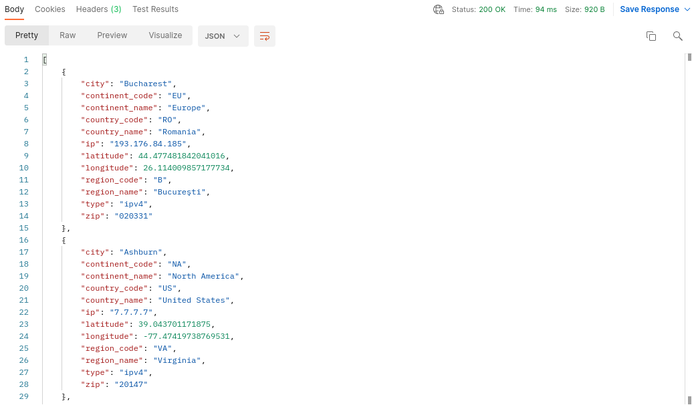

## tg-bot-smh
Bot is made for providing information about IPs
###  Admin /help

### User /help

#### Commands:
- For user:
    - "/ip [some_ipV4]" - show info about <some_ipV4>
    
      
    - "/history" - shows all your requested IPs
  
    - 
- For admin:
    - "/admin_new [user_id]" - add to user with <user_id> admin permissions
  
      
    - "/admin_delete [user_id]" - take away from user with <user_id> admin permissions
  
      
    - "/admin_user_history [user_id]" - show all request of user with <user_id>
  
      
    - "/admin_send_all [msg]" - send <msg> to all familiar to bot users
  
      

#### API (response in JSON):

- GET "{Hosting_URL}/API/get_users" - gives info about all users in bot's database

  
- GET "{Hosting_URL}/API/get_user?id={user_id}" - gives info about user with <user_id>

  
- GET "{Hosting_URL}/API/get_history_by_tg?id={user_id}" - gives info about IP check history of user with <user_id> 

  
- GET "{Hosting_URL}/API/delete_history_by_tg?id={history_ID}" - deletes one history row with ID <history_ID>

  

### Set up
For runnig bot, you need to change config variables in `config.yml`:

```
telegramBotToken : "Your_bot_telegram_token"
ipStackAccessKey : "Your_ipstack_token"
webhookURL : "Your_url_for_bot_to_set_webhook"
```
For running app use:
```
docker-compose up
```